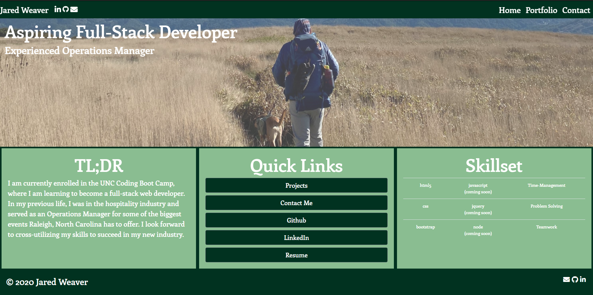
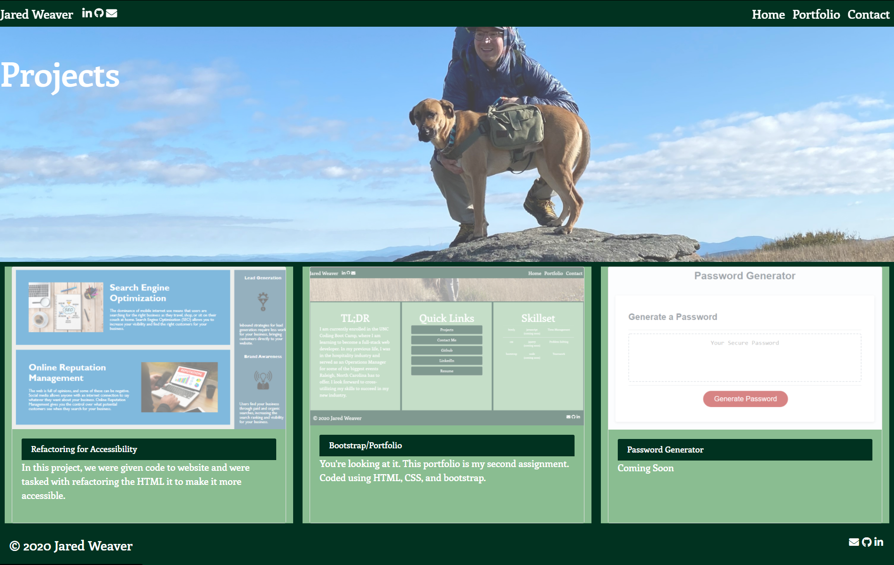
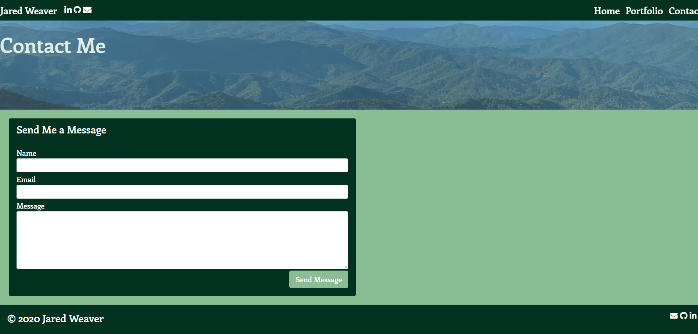

# JaredWeaver.github.io

Update 1.0 - Added gifs to portfolio page thumbnails and added more projects too.

## My Personal Webpage

 We were tasked with utilizing a combination of bootstrap and css to design a responsive personal portfolio which can be viewed on any device size. I found this assignment to be very invigorating and helped me learn proper webpage structure and design. I look forward to adding my further education to this page.

### Home Page Key Components

- Utilized a bootstrap navbar for the top of my page.
- Added in icons for my social media that interact just like the links do witha hover pseudo attached to them.
- Used a bootstrap jumbotron with a background image defined in CSS. This image highlights a recent trip I took to the Appalachian Trail.
- Used bootstrap's grid system for my <main> section. This columns are all responsive and were checked on dev tools.
- Utilzed bootstraps block buttons for my "Quick Links" section. Also added :hover to each link. 
- My footer is a static footer that also has links to my social networks. 
- Added a personalized favicon.

### Portfolio Page Key Components

- Converted thumbnails to gifs
- Same navbar as the home page.
- Same jumbotron setup as the home page.
- Utilzed bootstrap's cards components for each column in the main section. 
- Each card also returns to normal opacity when hovered upon, and all pictures link to their corresponding github repo.
- Same footer as the home page.

### Contact Page Key Components

- Same navbar as the home page.
- Same jumbotron setup as the home page.
- Utilzed bootstrap's forms to create a "Contact Me" form. 
- Would like to add in more personalized information and a proper about me.
- Same footer as the home page.

## Resources

- [Favicon.io](https://favicon.io) - used for my personalized favicon.

- [Font-Awesome](https://fontawesome.com) - used for all of my social media icons.

- [Nu HTML Checker](https://validator.w3.org/nu/) - used for html validation.

